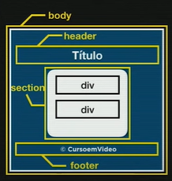
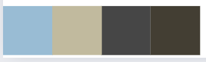

# Estudonauta | Projeto horas do dia

### Qual o objetivo desse site? 

Este projeto tem como objetivo criar um site que se adapte dinamicamente de acordo com o horário atual. Isso significa que o conteúdo e o design do site serão ajustados com base na hora do dia em que o usuário o acessa.

## Como foi feita a estrutura? 

  

## Qual a paleta de cores usadas?

  

- "#99bcd4" usada pra representar a foto de dia 
- "#C1BA9E" usada pra representar a foto de tarde
- "#464646" usada pra representar a foto de noite
- "#433E33" usada pra representar a foto de madrugada

####  As cores são selecionadas e utilizadas a partir do fundo das imagens para harmonizar com o conteúdo.

---
<h2 align="center">
  
</h2>

Desenvolvido com 🧡

